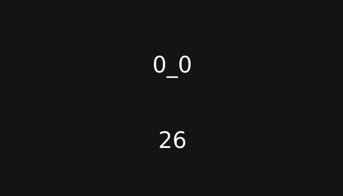

# uspokoysa
Dead simple Nim app for taking breaks.

Inpired by [pokoy](https://github.com/ttygde/pokoy).

<p align="center"></p>

## How it works
There are short and long breaks.

Suppose you are using such config (numbers correlate to dots and dashes on the schema below):
```
shortBreakDuration: 1    # in seconds
shortBreakInterval: 6    # in minutes
longBreakDuration: 3     # in minutes
longBreakInterval: 3     # in short breaks count
```

```
------<.>------<.>------<.>------<...>------<.>------<.>------<.>------<...>
_______|        |        |         |         |
short break #1  |        |         |         |
                |        |         |         |
________________|        |         |         |
short break #2           |         |         |
                         |         |         |
_________________________|         |         |
short break #3                     |         |
                                   |         |
___________________________________|         |
long break                                   |
                                             |
_____________________________________________|
short break #1 (again)
and so on...
```

## Configuration
`uspokoysa` uses config file at `~/.uspokoysarc`. If this file does not exist it will be created with default values.

### Breaks
The following params are responsible for break durations, intervals between them and notifications (see above for explanation, here are defaults):
```
shortBreakDuration: 20    # in seconds
shortBreakInterval: 15    # in minutes
longBreakDuration: 5      # in minutes
longBreakInterval: 3      # in short breaks count
timeBeforeNotification: 5 # in seconds
shortBreakNotificationCmd: notify-send -a "uspokoysa" "Uspokoysa!!!!1!!" -t 5000
longBreakNotificationCmd: notify-send -a "uspokoysa" "Uspokoysa!!!!1!!" -t 5000 -u critical
```

### Break notifications
You can specify commands to be executed at certain time before breaks start.

Use `timeBeforeNotification` to set at how many seconds before the break notification commands will be executed.

Use `shortBreakNotificationCmd` to set notification command for short breaks.

Use `longBreakNotificationCmd` to set notification command for long breaks.

### `i3` tweaking
If you like me (or you *are* me in distant future) are using awesome `i3` desktop manager - here is one helpfull setting to display `uspokoysa` in fullscreen on any current workplace:
```
for_window [class=Uspokoysa] floating enable, sticky enable, fullscreen
```
